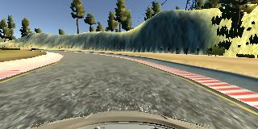
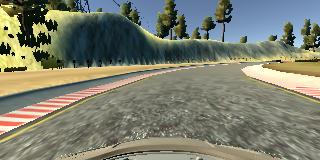
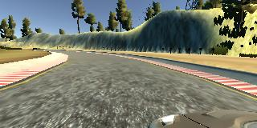
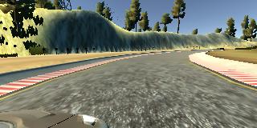
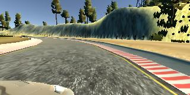
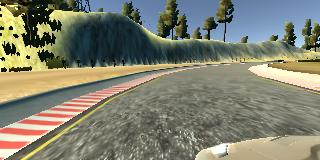

# Behavioral Cloning Project

## Overview
---
This repository contains files for the Behavioral Cloning Project.

The scope of the project is to clone driving behaviors in a simulator so that the vehicle can 'autonomously' navigate through
the route in the simulator.  
  
The project entailed the following steps:
1. Gathering data
2. Splitting data into train/test
3. Training the CNN model using Keras.
4. Running the model in the simulator to drive autonomously

This project tested my understanding of deep neural networks and convolutional neural networks to clone driving behavior. The final model outputs a steering angle to an autonomous vehicle.

There are five main files: 
* model.py (script used to create and train the model)
* drive.py (script to drive the car - feel free to modify this file)
* model.h5 (a trained Keras model)
* a report writeup file (either markdown or pdf)
* video.mp4 (a video recording of your vehicle driving autonomously around the track for at least one full lap)

## Step 1: Gathering Data
Though I initially attempted to gather more data on my own, this seemed to work poorly when training my network. So I have used the data provided from Udacity as both training and validation data.  
Because the data provided was not sufficient enough for training the model to generalize to autonomously drive around the whole track, I augmented the data in the following ways:
* Flipping the images along the vertical axis and inverting the steering measurements.
* Using the left camera images and adding offset in steering measurements.
* Using the right camera images and subtracting offset in steering measurements.

   
Center Image and Center Image Inverted <br/>
   
Left Image and Left Image Inverted <br/>
   
Right Image and Right Image Inverted <br/>

## Step 2: Splitting the Data
```python

```
## Step 3: Training the model
### Training Model Architecture
My model borrowed heavily from the NVIDIA architecture. I have added a dropout of 0.3 after each convolution layer.
The CNN used a 5x5 and 3x3 kernel. The RELU activation were used to introduce nonlinearity.
```python
model.add(Conv2D(24, (5,5), strides=(2,2), activation='relu'))
model.add(Dropout(0.3))
model.add(Conv2D(36, (5,5), strides=(2,2), activation='relu'))
model.add(Dropout(0.3))
model.add(Conv2D(48, (5,5), strides=(2,2), activation='relu'))
model.add(Dropout(0.3))
model.add(Conv2D(64, (3,3), activation='relu'))
model.add(Dropout(0.3))
model.add(Conv2D(64, (3,3), activation='relu'))
model.add(Dropout(0.3))

model.add(Flatten())
model.add(Dense(100, activation='relu'))
model.add(Dense(50, activation='relu'))
model.add(Dense(10, activation='relu'))
model.add(Dense(1))
```
### Hyper-parametner 
The keras model was compiled using the ADAM optimizer (for faster and more effective training) and MSE loss (regression problem to fit steering angle).
``` python
model.compile(loss='mse', optimizer=ADAM)
```
However, there were several hyper-parameters that have been tuned heavily.
These were some of the parameters that have been tuned during the process of training:
* learning_rate=0.001. Tried to play with values such as 0.0001 but was too slow at learning and the training loss did not improve.
* epoch=5. Tried to tune this number to be 20, however a high number of epoch would result in overfitting and negatively influenced the generalization of the model.
* SAS_corr=0.08. This was the correction factor that was used to offset the steering angle correction for left and right camera images. The value of 0.2 seemed to make the vehicle oscillate and lowering this number resulted in much smoother performance.

### Training Loss vs Validation Loss
Below is the plot of the training loss vs the validation loss over the course of 5 epochs.

## Step 4: Running the model
After many, many, many training, tuning, and validation, I was able to finally get a model that was able to navigate through the course.

video.mp4

## Conclusion
One of the most usefuly takeaway from this project for me was using OOP to structure my pipeline. Having a background mostly in MATLAB and script languges, I am not comfortable writing classes. However, after looking at examples online, many people seem to write their pipeline using the OOP approach.
  
Aside from the positives, there are many things that can be approved with my model:
* Gathering Data. I could have definitely used much more data to train my model to navigate smoother in entrance of curves.
* Augmentating Data. I could have also added noise, translated the images.
* Track 2. Definitely will go back to this project to train a model that can navigate through track 2.
